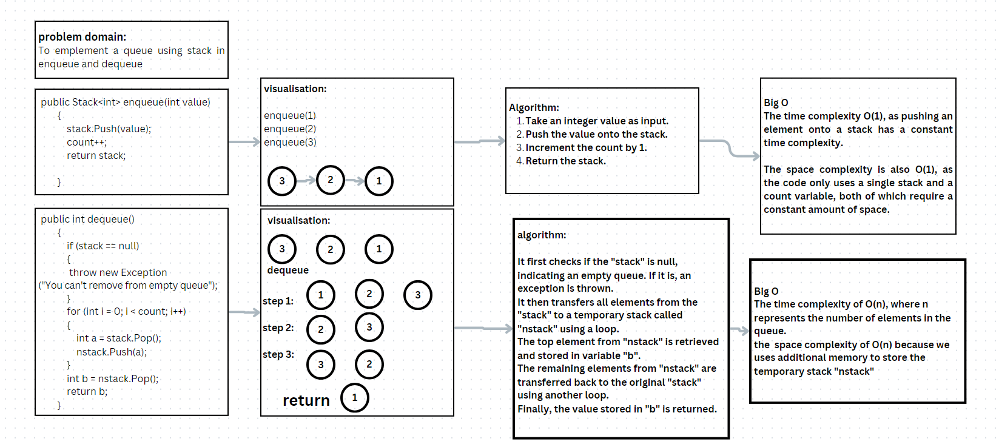
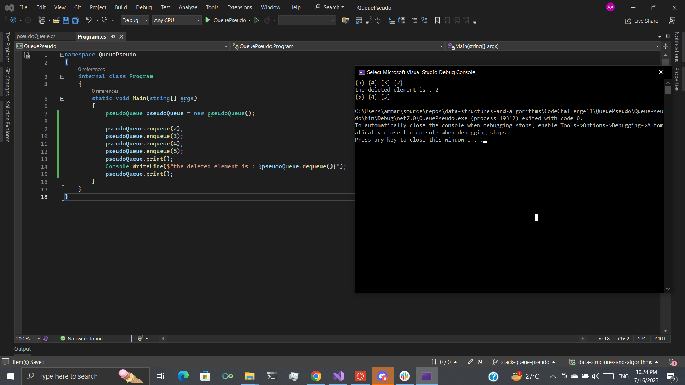

## Stack Queue Pseudo

in this challenge we implement the queue using a stack method 

## white board

## Approach & Efficiency

In the code, the enqueue method adds an element to the stack and increments the count variable to keep track of the number of elements in the pseudo queue. It returns the stack after pushing the value. The enqueue operation has a time complexity of O(1) since pushing an element onto a stack takes constant time.

The dequeue method is used to remove and return the front element of the pseudo queue.
It follows a specific approach to mimic a queue using stacks. First, it checks if the stack is empty and throws an exception if it is.
Then, it reverses the order of elements by popping all the elements from the stack and pushing them onto the nstack.
It then pops the top element from nstack and assigns it to the variable b, which represents the element being dequeued. 
Next, it pops all the remaining elements from nstack and pushes them back onto the stack to restore the original order.
Finally, it returns the value of b. 

The dequeue operation has a time complexity of O(n), where n is the number of elements in the pseudo queue. 
In the worst case, all the elements need to be popped and pushed, resulting in linear time complexity.

## solution

