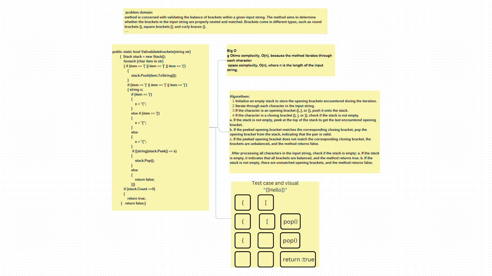

## Valivalidatebrackets
it a method to cheack if the brackets in the string are in the right way 

## Approach & Efficiency

The `validatebrackets` method takes an input string and uses a stack-based approach to efficiently validate the balance of brackets within
the string. By iterating through each character in the string, it identifies opening brackets (`(`, `[`, or `{`) 
and pushes them onto the stack. When encountering a closing bracket (`)`, `]`, or `}`), 
the method verifies if the corresponding opening bracket is at the top of the stack. If the opening bracket matches,
it is popped from the stack, signifying that the pair is valid. However,
if the top of the stack does not match the corresponding opening bracket, 
the brackets are unbalanced, and the method returns `false`. Once the entire string is processed, if the stack is empty, 
it indicates that all brackets are balanced, and the method returns `true`. Due to its linear time complexity, O(n),
where n is the length of the input string, and its linear space complexity, O(n),
the `validatebrackets` method provides an efficient solution for bracket validation in a given string.

## whiteboard

## Solution

