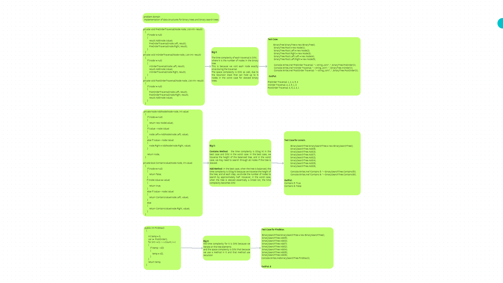
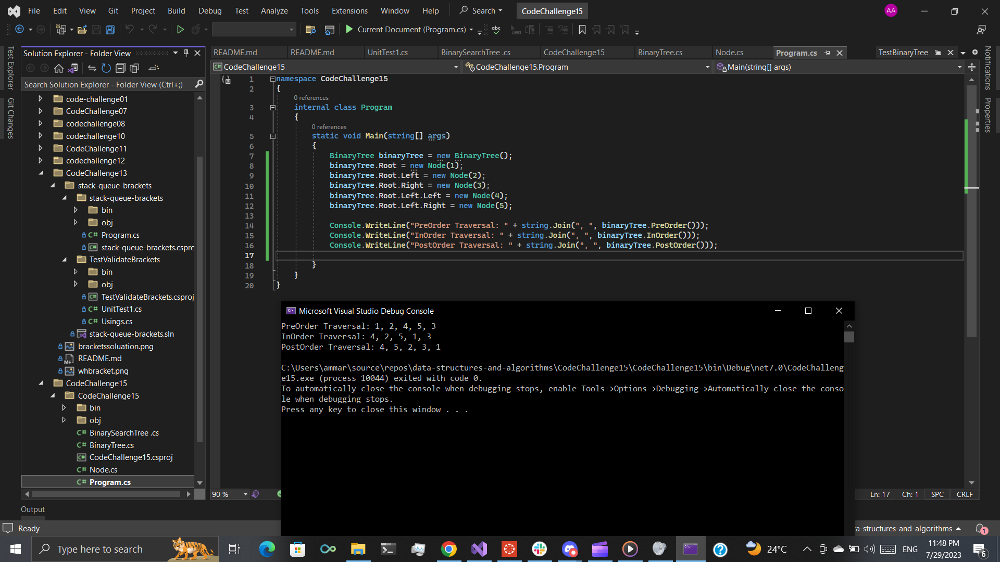
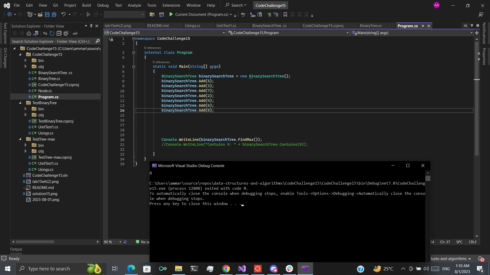

## Trees 
this code implement a tree data structure and you can traverse in the tree in three ways:

1-inorder 

2-postorder 

3-preorder

 ## Approach & Efficiency

### Node Class:

The Node class has a simple structure with three properties: Value, Left, and Right. The space complexity for each node is O(1) as it only stores three integer values.

### Binary Tree Class:
The BinaryTree class implements the depth-first traversals 
(pre-order, in-order, and post-order). The time complexity of each traversal is O(N),
where N is the number of nodes in the binary tree. 
This is because we visit each node exactly once during the traversal.
The space complexity is O(N) as well, due to the recursion stack that can hold up to N nodes in the worst case for skewed binary trees.

### Binary Search Tree Class:
The BinarySearchTree class is a subclass of BinaryTree and adds the methods for adding nodes
and checking for the existence of a value. The time complexity of the Add method is O(log N)
on average, and O(N) in the worst case. This is because, in a balanced , 
we traverse the height of the tree, which is log N.
in the worst case when it became a linked list, 
and the time complexity becomes O(N).
The space complexity for the Add method is also O(log N) 
on average and O(N) in the worst case due to the recursion stack.

## FindMax
Is method to find the max number in the tree even it is the root or not and the time complexity for it is O(N) because we iterate on the tree elements
and the space complexity is O(N) that because we use a method in it and that method use recursion

## Breadth-first approach

Breadth-first search involves search through a tree one level at a time.

We traverse through one entire level of children nodes first,
Before moving on to traverse through the grandchildren nodes.
And we traverse through an entire level of grandchildren nodes
Before going on to traverse through great-grandchildren nodes.
breadth first traversal uses a queue (instead of the call stack via recursion) to traverse the width/breadth of the tree.

## Approach & Efficiency
Method	Time Complexity	Space Complexity
Breadth-first	O(n)	O(1)

## whiteboard
.png)

## whiteboard for FindMax

## solution

## solution for FindMax

## solution for Breadth-first approach

