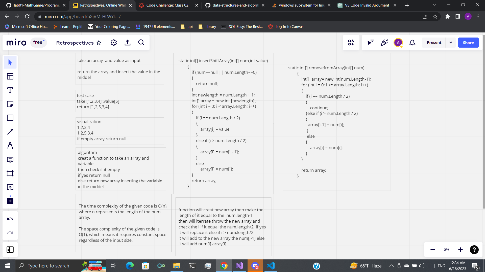

# Challenge array-insert-shift
to create a function to insert value in the middel of array;

## Whiteboard Process

## Approach & Efficiency
function to take array and insert value in the middel of the array using for loop and if else condition the big o is o(n)
because the for loop 

## Solution
.png)
