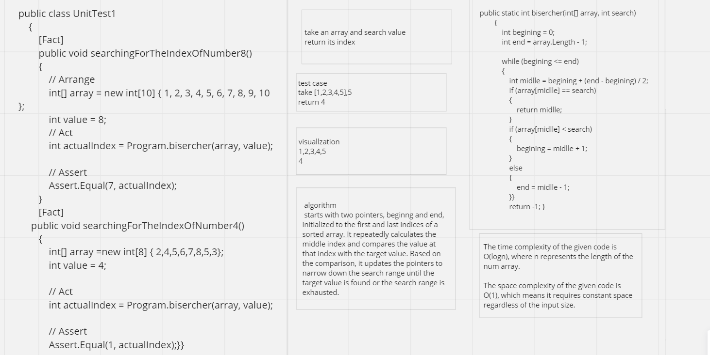
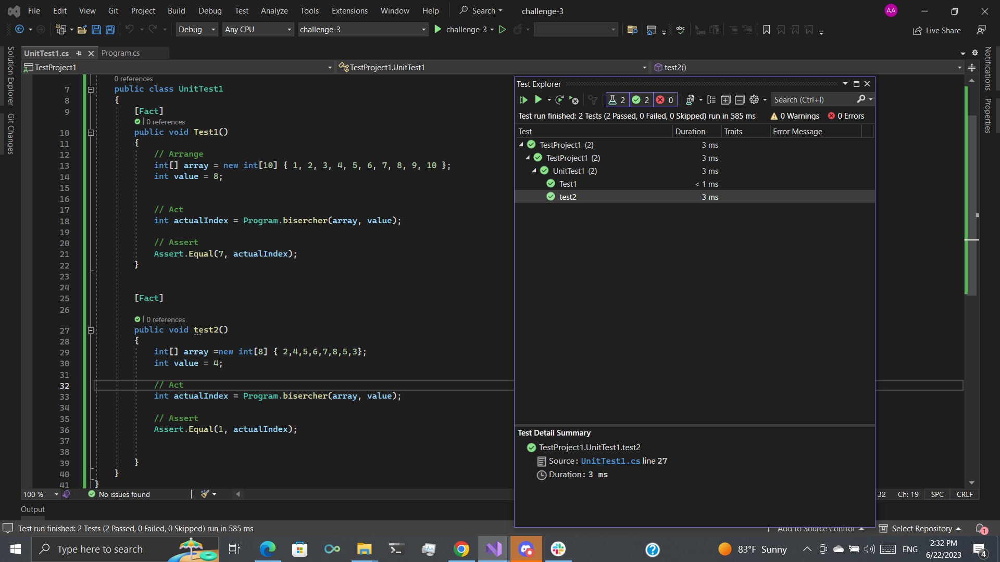

# Challenge binary search
to create a function to search the array for specific value
## Whiteboard Process

## Approach & Efficiency
function to take a sorted array and search for value by binary search big O time complexity O(logn) and space complexity O(1)
## Solution

## xunite test

