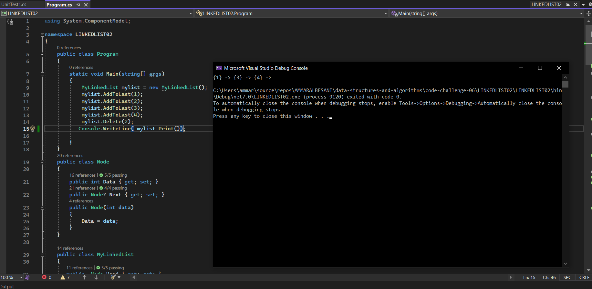
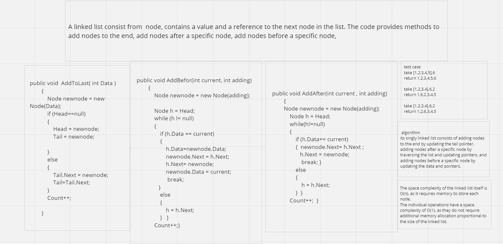

## linkedlist
This code is to implement a linked list and add to first, search, and create a string with all data  

## Approach and efficiency

The provided code implements a singly linked list data structure with operations to add elements at the end and print the list, Add before and after a selected node
and remove a selected value
The efficiency of the 'Add last' operation is constant time O(1) since it takes a constant amount of time regardless of the size of the list.
The efficiency of the 'add before ' operation is linear time O(n) This occurs when the current node is the first node, and we need to traverse the entire list.
The efficiency of the 'add after ' operation is linear time O(n) This occurs when the current node is the last node, and we need to traverse the entire list.
## solution

## whiteboard

