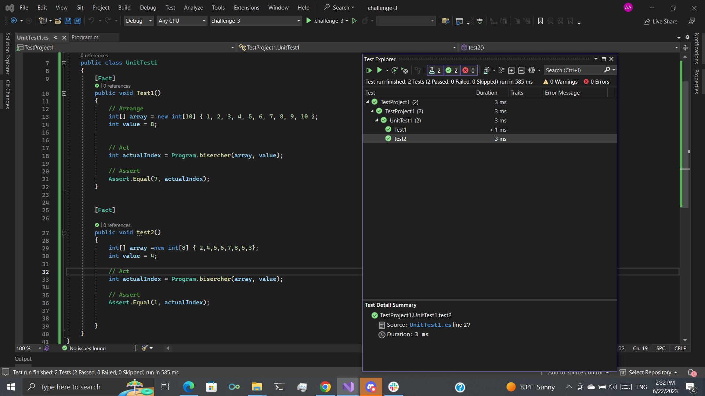

## linkedlist
This code is to implement linked list and add to first, search ,and create string with all data  

## approach and efficiency

The provided code implements a singly linked list data structure with operations to add elements at the beginning and print the list. The 'Find' method checks if a given value exists in the list. 
The approach is to traverse the list from the head until the value is found or the end of the list is reached.
The efficiency of the 'Addfirst' operation is constant time O(1) since it only updates the head and tail pointers
The efficiency of the 'Find' operation is linear time O(n) as it may need to traverse the entire list in the worst case.

## solution

