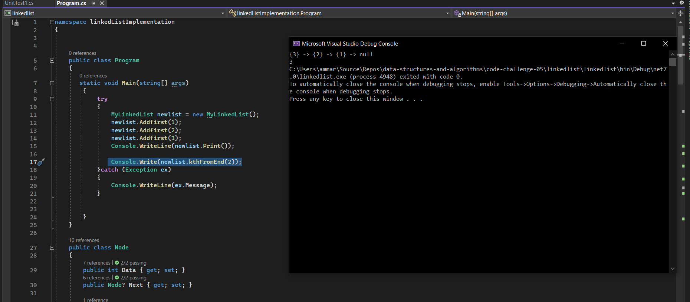
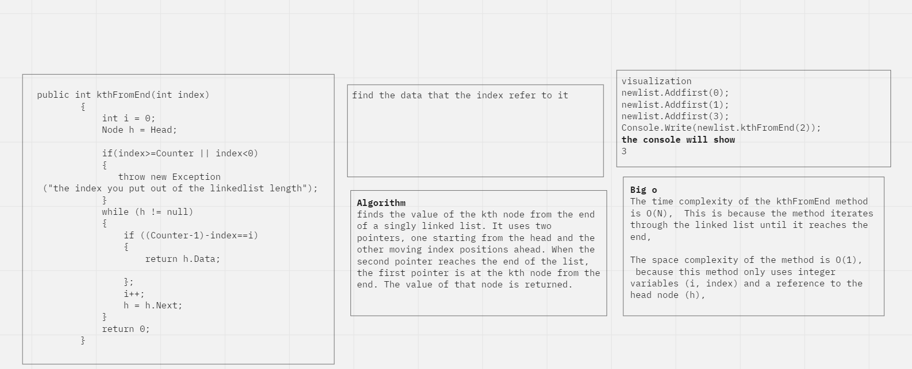

## k-th value from the end of a linked list
This code provides a way to find the node in the LinkedList by treating it like an array that it an index of its start of 0 
## Approach and efficiency
The given code implements a method called kthFromEnd to find the kth element from the end of a singly linked list. It checks if the given index is valid and throws an exception if it is out of bounds. The code then iterates through the linked list and compares the position to the desired kth element. If found, the method returns the corresponding item; otherwise, it returns 0. If the length of the linked list is strictly preserved, the time complexity of this method is O(n), and the space complexity is O(1).
## solution

## whiteboard

