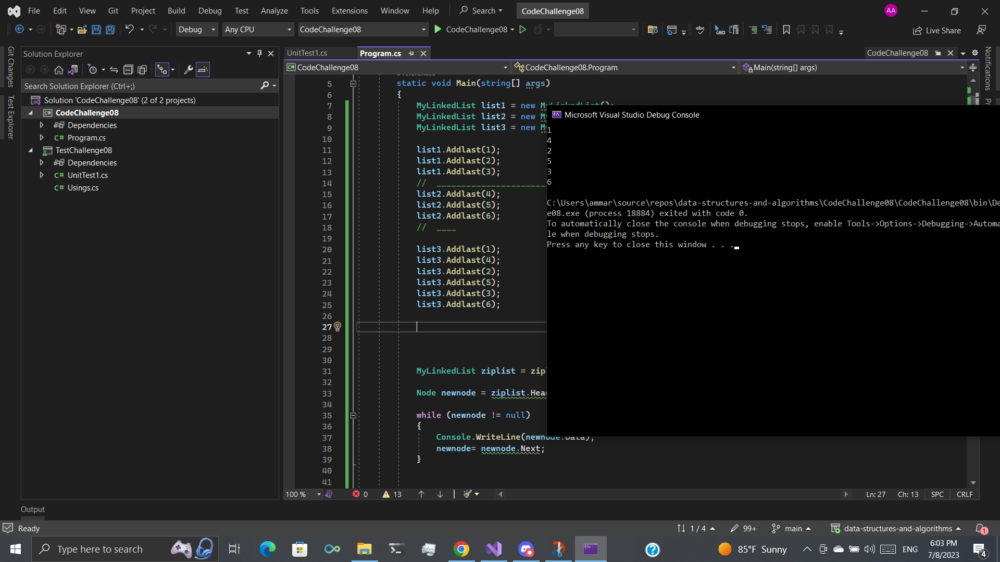
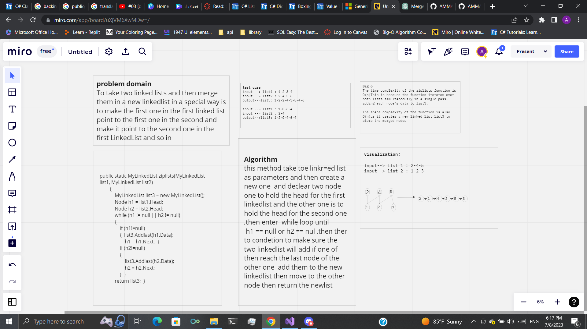

# ziplinkedlist

To take two linked lists and then merge them in a new linkedlist in a special way is to make the first one in the first linked list point to the first one in the second and make it point to the second one in the first LinkedList and so in

# Approach and efficiency

The ziplists function provides an efficient solution to merge two linked lists in a specific manner. It iterates over both input lists simultaneously, maintaining two pointers to their respective heads. The function creates a new linked list and alternately adds nodes from both lists to the merged list until one of the lists reaches the end. It then appends the remaining nodes from the other list.

The algorithm has a time complexity of O(n), where n is the total number of nodes in both input lists. It achieves this by iterating through the lists once. The space complexity is also O(n), as it creates a new linked list to store the merged nodes.

# solution

# whiteboard

