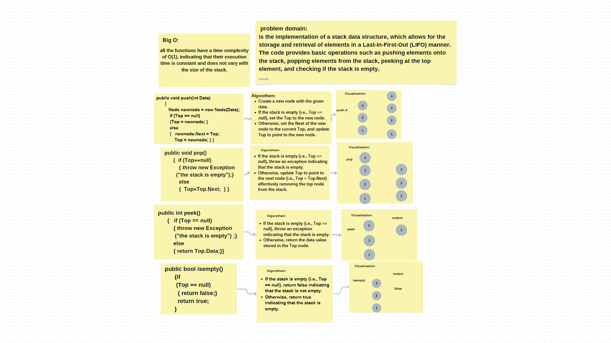
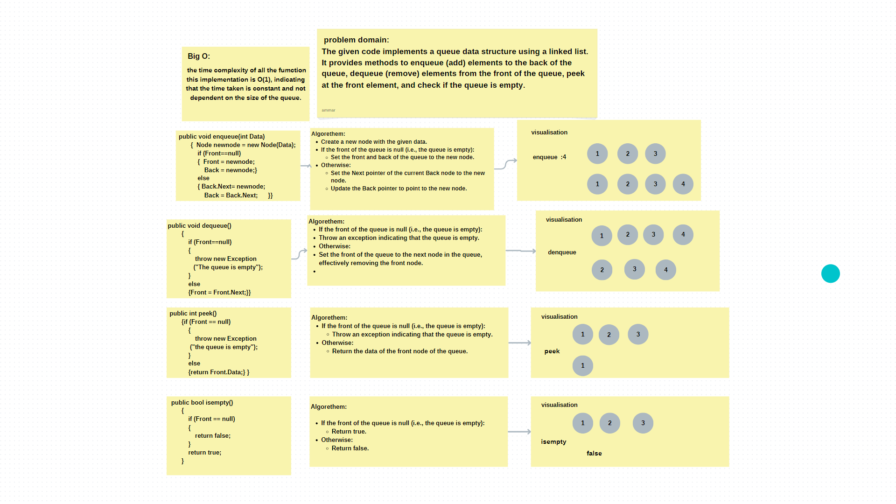
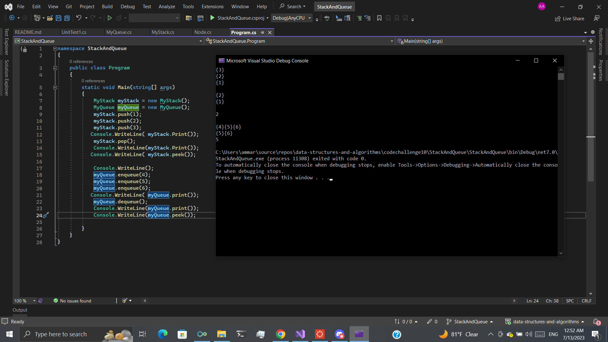

# Qtack and Queue

this code show the implementation of stack and queue and the functio on them like push , pop ,peek , isempty for stack
and enqueue ,denqueue ,peek , isempty for queue 

## Approach & Efficiency

***For Stack***:

1-Push Operation: The push method adds a new node containing the given data to the top of the stack. If the stack is empty, the Top reference is set to the new node. Otherwise, the new node's Next reference is set to the current top node, and the Top reference is updated to the new node. This operation has a time complexity of O(1) since it performs a constant number of operations regardless of the size of the stack.

2-Pop Operation: The pop method removes the top node from the stack by updating the Top reference to the next node. If the stack is already empty, an exception is thrown. This operation also has a time complexity of O(1) since it performs a constant number of operations.

3-Peek Operation: The peek method returns the value of the data in the top node without removing it. If the stack is empty, an exception is thrown. Similar to push and pop, this operation has a time complexity of O(1) since it directly accesses the Data property of the Top node.

4-IsEmpty Operation: The isempty method checks if the stack is empty by checking if the Top reference is null. If it is null, it returns true, indicating that the stack is empty; otherwise, it returns false. This operation also has a time complexity of O(1) as it only involves a single comparison.

***For Queue***:

1-enqueue(int Data): This method adds an element to the back of the queue. It creates a new node with the given data and sets it as the Back of the queue. If the queue is empty, both Front and Back are set to the new node. The time complexity of this method is O(1).

2-dequeue(): This method removes the element from the front of the queue. It updates the Front pointer to point to the next node in the queue. If the queue is empty, it throws an exception. The time complexity of this method is O(1).

3-peek(): This method returns the element at the front of the queue without removing it. If the queue is empty, it throws an exception. The time complexity of this method is O(1).

4-isempty(): This method checks if the queue is empty. It returns false if the Front pointer is null, indicating an empty queue, and true otherwise. The time complexity of this method is O(1).

## whiteboard

____

## solution

