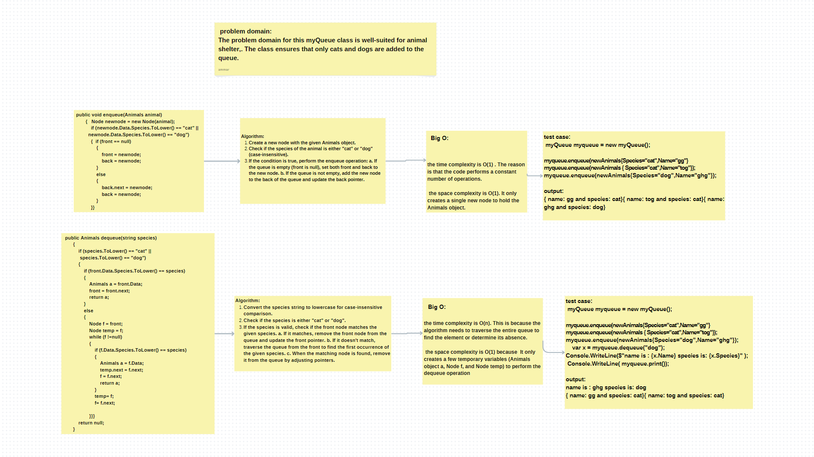

## animalshelter

The code defines a class `myQueue`, which implements a basic queue data structure for managing a collection of animals.
The `enqueue` method allows adding animals with the species "cat" or "dog" to the back of the queue by creating new nodes and updating the `front` and `back` pointers accordingly.
The `dequeue` method removes the first occurrence of an animal with a specified species ("cat" or "dog") from the front of the queue,
efficiently updating the pointers to reorganize the queue.
The code utilizes a singly linked list representation to dynamically handle varying numbers of animals and ensures efficient enqueue and dequeue operations. 

## Approach & Efficiency:

The approach taken in the code involves implementing for queue data structure using a singly linked list to manage a collection of animals. The code consists of two primary methods: enqueue and dequeue, which handle the insertion and removal of animals in the queue.

Enqueue Operation:

The enqueue method takes an Animals object as input and adds it to the back of the queue if its species is either "cat" or "dog." It creates a new node containing the animal data and updates the front and back pointers accordingly.
Time Complexity: O(1)
The enqueue operation is performed in constant time, as it only involves creating a new node and adjusting two pointers (front and back), regardless of the number of animals in the queue. The conditional check for "cat" or "dog" species is also a constant time operation.

equeue Operation:

The dequeue method takes a species string as input and removes the first occurrence of an animal with the specified species ("cat" or "dog") from the front of the queue. It performs a case-insensitive comparison to check if the given species is valid, and then it handles the removal efficiently by updating the front pointer.
Time Complexity: O(n) in the worst case.

## whitebord

## solution

.png)