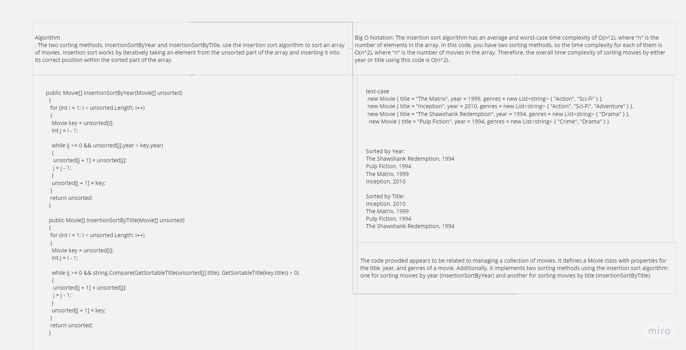

Code Description:

The code defines a C# class named Movie and implements two sorting algorithms using the insertion sort technique: InsertionSortByYear and InsertionSortByTitle. These methods allow sorting an array of movie objects by their release year and title, respectively.

Approach & Efficiency:

InsertionSortByYear sorts movies by their release year in ascending order using the insertion sort algorithm. The time complexity is O(n^2), where n is the number of movies.

InsertionSortByTitle sorts movies by their titles in lexicographical order while handling articles (e.g., "The", "A", "An") correctly. The time complexity is also O(n^2).

Whiteboard Representation:

Here's a whiteboard representation of the code:

